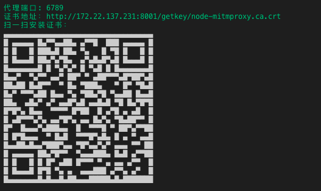

# 代理模式开发

调试线上编译处理过的非可读性代码，可以使用本功能

通过简单的 chameleon 配置将线上文件代理到线下的开发环境，这样就可以通过修改线下的源码 debug 线上页面了，使用方法如下：

## 第一步

chameleon.config.js 中开启代理模式:

```javascript
{
    ...
    proxy: {
        enable: true,
    }
    ...
}
```

## 第二步

执行以下命令

```
cml dev
```

## 第三步

根据调试面板打印的信息给手机安装证书



## 第四步

根据上图提示将手机代理到相应的端口

完成以上步骤就可以进行代理开发了。

默认代理了 weex 和 web 端的 js 和 css 文件，如需代理更多文件，可以  添加 mapremote 配置，方法如下：

```javascript
{
    ...
    proxy: {
        enable: true,
        mapremote: [{
            from: 'https://a.b.com/weex/aaa_(.+).js',
            to: 'http://localhost:8000/weex/aaa.js'
        },{
            from: 'https://a.b.com/weex/bbb_(.+).js',
            to: 'http://localhost:8000/weex/bbb.js'
        }]
    }
    ...
}
```
