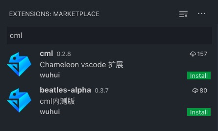
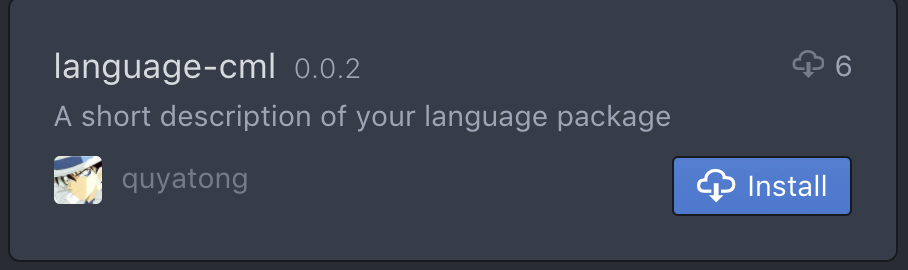
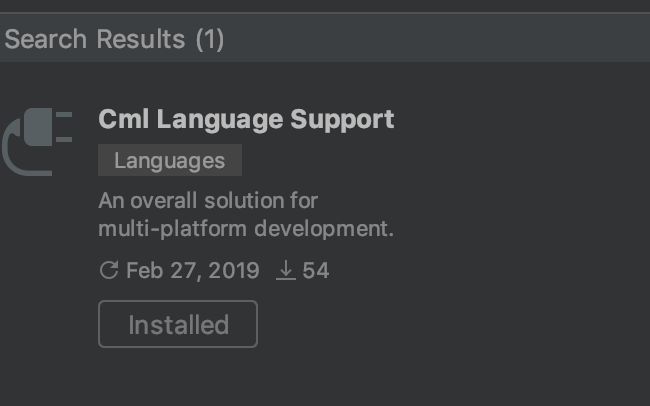

## 编辑器插件

chameleon 项目编辑器中语法高亮，暂时使用.vue 的插件，后续会推出更强大的插件，各编辑器配置插件教程如下：

### Visual Studio Code

在`vscode` 左侧`Extensions`搜索框中输入 cml，点击 install 安装 cml 插件。



目前最新正式版为 0.2.8

支持以下功能

- 语法高亮

  cml 文件代码高亮，清晰美观

- 内置、扩展、自定义组件名称补全

  在 template 中，提供 cml 内置组件、cml-ui 中的扩展组件以及用户自定义的组件名称补全提示

- 组件属性补全以及属性的类型和默认值提示

  在 template 中，提供组件的属性补全提示，并根据组件定义给出该属性的类型和默认值

- 指令补全

  在 template 中，提供 cml 指令补全提示

- css 补全

  在 style 中，css 代码补全提示

在 alpha 内测版本中，提供了更多功能

- linter 校验及提示
- format cml 文件

注意：

- 请不要同时使用内测版和正式版

- 安装过程中，如遇到问题，建议先升级一下 vscode

### Atom

使用快捷键打开编辑器设置页面：

```
  command + ,(逗号)
```

选择左侧的`Install` Tab，然后在搜索框输入`language-cml`, 在搜索结果中找到 cml 语言支持并安装



### Webstorm

使用快捷键打开编辑器设置页面：

```
 command + ,(逗号)
```

选择左侧`plugins`，然后在搜索框输入`cml-language-support`，然后安装。


