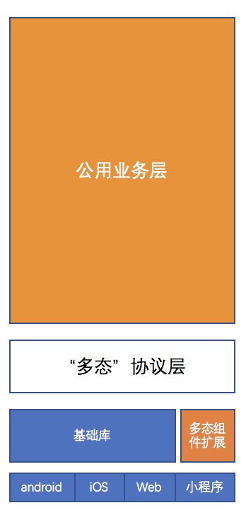
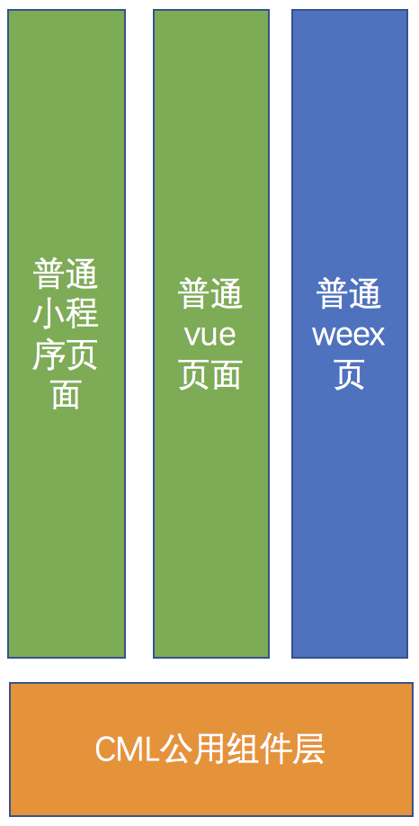

### 渐进式接入(Progressive)

跨端有 2 种需求。

- **整个项目一套代码实现**：第一种业务层需求在各端环境高度类似，原本需要针对不同端重复开发、重复测试，那么使用 Chameleon 将整个项目”从上至下“都用一套代码运行，针对各端底层极个别差异化实现（使用多态协议）。 - 场景举例：首页官网、列表详情页等
- **仅组件一套代码运行**：第二种是各端页面需求不一致，却有共同的组件需要重复开发、重复测试，各个端用各自原本框架开发（或者使用 Chameleon 方案)，使用一套代码开发公用组件，然后各个端可以使用公用组件实现业务 - 场景举例：分享组件、支付组件、地图组件

<table>
  <tr>
    <th><em>整个项目</em>一套代码实现</th>
    <th><em>仅组件</em>一套代码运行</th>
  </tr>
  <tr>
    <td></td>
    <td></td>
  </tr>
</table>

#### 相关链接

- [webpack 集成](/framework/webpack_plugin.html)
- [组件导出应用](/framework/compont_export.html)
