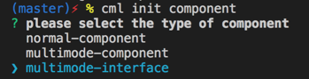

## 生命周期

chameleon 为[组件](../component/component.html)和 页面 提供了一系列生命周期事件，保障应用有序执行。
如果你想使用某个端特定的生命周期，请从业务出发使用 [接口多态](../framework/polymorphism/api.html) 接收特定的生命周期事件回调。

<table>
  <tr>
    <th>钩子</th>
    <th>执行时机</th>
    <th>详细</th>
  </tr>
  <tr>
    <td>beforeCreate</td>
    <td>实例初始化之后，数据和方法挂在到实例之前
    </td>
    <td>
      页面会在该生命周期中返回传入当前页面的参数对象
  </tr>
  <tr>
    <td>created</td>
    <td>数据及方法挂载完成</td>
    <td>页面会在该生命周期中返回传入当前页面的参数对象</td>
  </tr>
  <tr>
    <td>beforeMount</td>
    <td>开始挂载已经编译完成的cml到对应的节点时</td>
    <td>在页面会在该生命周期中返回传入当前页面的参数对象</td>
  </tr>
  <tr>
    <td>mounted</td>
    <td>cml模板编译完成,且渲染到dom中完成</td>
    <td></td>
  </tr>
  <tr>
    <td>beforeDestroy</td>
    <td>实例销毁之前</td>
    <td></td>
  </tr>
  <tr>
    <td>destroyed</td>
    <td>实例销毁后</td>
    <td></td>
  </tr>
</table>

#### 页面 Page 独有生命周期

##### onShow()

> chameleon-runtime@0.2.0 开始支持

页面显示/切入前台时触发

##### onHide()

> chameleon-runtime@0.2.0 开始支持

页面隐藏/切入后台时触发

** 注意：页面不会在 onShow、onHide 回调函数中返回页面参数 **

#### 生命周期回调函数

##### beforeCreate(Object res)

参数说明

<table>
  <tr>
    <th>名称</th>
    <th>类型</th>
    <th>说明</th>
  </tr>
  <tr>
    <td>res</td>
    <td>Object</td>
    <td>
      仅有页面在该生命周期回调函数中会
      <br/>
      返回对象res:
      <br/>
      res = { query }
      query 是打开当前页面路径中的参数
    </td>
  </tr>
</table>

##### created(Object res)

参数说明

<table>
  <tr>
    <th>名称</th>
    <th>类型</th>
    <th>说明</th>
  </tr>
  <tr>
    <td>res</td>
    <td>Object</td>
    <td>
      仅有页面在该生命周期回调函数中会
      <br/>
      返回对象res:
      <br/>
      res = { query }
      query 是打开当前页面路径中的参数
    </td>
  </tr>
</table>

##### beforeMount(Object res)

参数说明

<table>
  <tr>
    <th>名称</th>
    <th>类型</th>
    <th>说明</th>
  </tr>
  <tr>
    <td>res</td>
    <td>Object</td>
    <td>
      仅有页面在该生命周期回调函数中会
      <br/>
      返回对象res:
      <br/>
      res = { query }
      query 是打开当前页面路径中的参数
    </td>
  </tr>
</table>

#### 钩子示例

```html
<template>
  <view> </view>
</template>
<script>
  class Index {
    beforeCreate(query) {
      // data数据挂载到this根节点上之前，以及methods所有方法挂载到实例根节点之前
      // 注意：只用页面的 beforeCreate钩子 会返回页面query
      console.log('App beforeCreate: 打开当前页面路径中的参数是 ', query);
    }
    created() {
      // data,methods里面的这些events挂载完成
      console.log('App created');
    }
    beforeMount() {
      // 开始挂载已经编译完成的cml到对应的节点时
      console.log('App beforeMount');
    }
    mounted() {
      // cml模板编译完成,且渲染到dom中完成,在整个生命周期中只执行一次
      console.log('App mounted');
    }
    beforeDestroy() {
      // 实例销毁前
      console.log('App beforeDestroy');
    }
    destroyed() {
      // 实例销毁后
      console.log('App destroyed');
    }
  }
  export default new Index();
</script>
```

### 生命周期多态

`cml` 在 <a href="../../framework/polymorphism/component.html#webweexwxcml">\*.[web|weex|wx].cml</a> 文件中支持生命周期的多态，可以针对不同的平台添加专属钩子函数。

假设有一个页面`home.cml`，需要使用小程序页面分享生命周期[微信端 onShareAppMessage](https://developers.weixin.qq.com/miniprogram/dev/reference/api/Page.html#onShareAppMessage-Object-object)，可以如下实现：

1. 项目根目录执行 `cml init component`，选择 `multimode-interface` 多态接口，输入 interface name: `lifecycleInterface`，自动生成`src/components/lifecycleInterface`
   

2. 在`src/components/lifecycleInterface/lifecycleInterface.cml`多态接口中，添加如下代码：

```html
<script cml-type="interface">
  interface LifecycleInterfaceInterface {
    onShareAppMessage(): void;
  }
</script>

<script cml-type="web">
  class Method implements LifecycleInterfaceInterface {
    onShareAppMessage() {
      console.log('web share');
    }
  }
  export default new Method();
</script>

<script cml-type="weex">
  class Method implements LifecycleInterfaceInterface {
    onShareAppMessage() {
      console.log('weex share');
    }
  }
  export default new Method();
</script>

<script cml-type="wx">
  class Method implements LifecycleInterfaceInterface {
    onShareAppMessage() {
      console.log('wx share');
    }
  }
  export default new Method();
</script>

<script cml-type="alipay">
  class Method implements LifecycleInterfaceInterface {
    onShareAppMessage() {
      console.log('alipay share');
    }
  }
  export default new Method();
</script>

<script cml-type="baidu">
  class Method implements LifecycleInterfaceInterface {
    onShareAppMessage() {
      console.log('baidu share');
    }
  }
  export default new Method();
</script>
```

3. 在 `home.cml` 文件，使`methods`合并`lifecycleInterface`多态方法

```html
<template>
  <view>
    <text>home页面</text>
  <view>
</template>
<script>
import lifecycleInterface from '../../components/lifecycleInterface/lifecycleInterface'
  class Home {
    data = {}
    computed = {}
    watch = {}
    methods = {
      ...lifecycleInterface
    }
    beforeCreate(res) {}
    created() {}
  }
  export default new Home()
</script>
```
