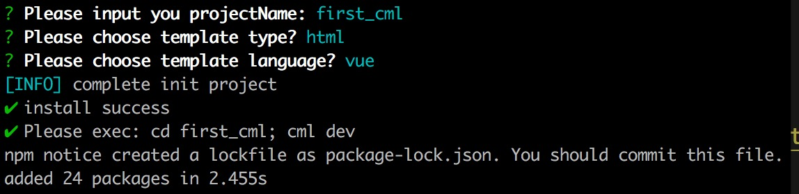

## 安装启动

#### 1 运行环境

##### node && npm

chameleon-tool 是 chameleon 的脚手架工具，其中采用了 es6 语法，shrinkwrap 版本固化等新特性，<b>所以要求 node 版本>=8.10.0, npm>=5.6.0<b>。
建议安装[nvm](https://github.com/creationix/nvm)管理 node 版本。

#### 2 全局安装 chameleon-tool 构建工具

`npm i -g chameleon-tool`

安装成功后，执行 `cml -v` 即可查看当前版本， `cml -h`查看命令行帮助文档。

#### 3 创建项目与启动

- 执行 `cml init project`
- 输入项目名称
- 等待自动执行 npm install 依赖

<br/>


- 切换到项目根目录执行`cml dev`
- 会自动打开预览界面 预览界面如下：


##### php-cgi

如果 web 端的项目模板是纯 html 文件，则不需要安装`php-cgi`。

如果 web 端项目采用 smarty 模板，本地调试需要  模拟 smarty 语法，依赖 php-cgi 对 smarty 模板进行渲染，需要安装`php-cgi`，<b>如果执行`php-cgi -v` 命令，可以看到版本信息，则证明已经安装，可以跳过 php-cgi 的安装</b>。

- 方法一 针对 mac：
  首先确保安装 brew，若未安装，参见： https://brew.sh/。
  安装后执行 `brew install php@7.1 --with-cgi`
  根据安装后的提示，配置环境变量，执行:

```bash
echo 'export PATH="/usr/local/opt/php@7.1/bin:$PATH"' >> ~/.bash_profile
echo 'export PATH="/usr/lcal/opt/php@7.1/sbin:$PATH"' >> ~/.bash_profile
source ~/.bash_profile
```

执行`PHP -v`就可以看到安装的 php 版本

- 方法二:
  针对所有 mac 和 window 系统都可以直接百度下载 XAMPP，双击安装；等安装成功后需要把 XAMPP 的 bin 目录设置到 环境变量里面；

```
echo 'export PATH=/Applications/XAMPP/bin:$PATH' >> ~/.bashrc
source ~/.bashrc
```

window 下的 xampp 的 bin 目录可能不一样,需要自行查看
