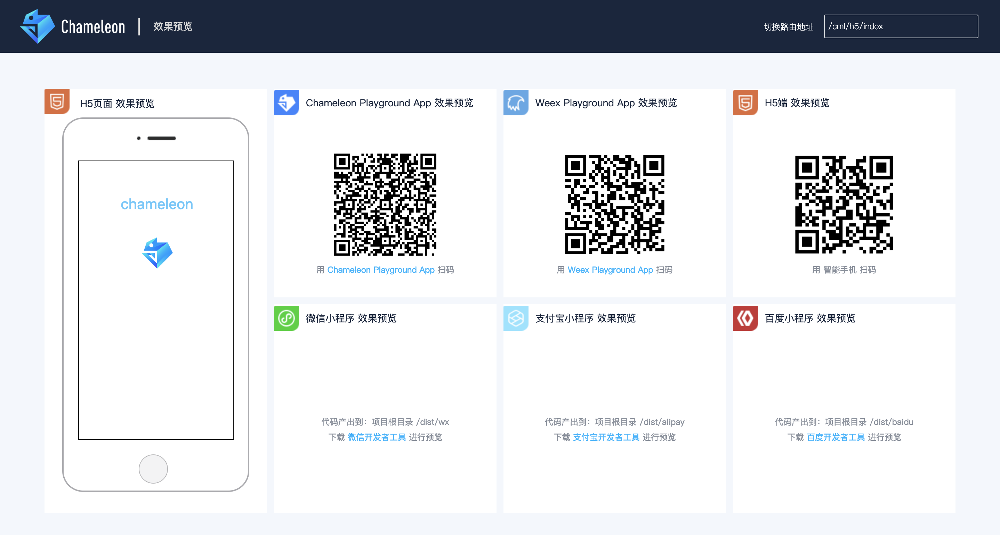

# 开发你的第一个 CML 应用

跟随这个教程，开启你的 chameleon 跨端开发。

## 视频教程

<video width="100%" src="http://sfwb.didistatic.com/static/wb/5%E5%88%86%E9%92%9F.mp4" controls="controls"></video>

## 起步

### 安装运行环境

开发 chameleon 项目的第一步是要安装运行环境和全局安装 chameleon-tool。

> **[success] 运行环境 **
>
> [node](https://nodejs.org/en/download/) >= 8.10.0
> npm >= 5.6.0

建议安装使用 [nvm](https://github.com/creationix/nvm) 管理 node 版本。

### 安装命令行工具

```shell
npm i -g chameleon-tool
```

<b style="font-size: 14px;">注：暂不支持使用 yarn、cnpm 等第三方 npm 工具进行安装。</b>

安装成功后，执行 `cml -v` 即可查看当前版本， `cml -h`查看命令行帮助文档，更多命令参见<a href="../quick_start/cml_cmd">命令行工具</a>。接下来就可以使用它快速的创建 chameleon 项目。

### 创建与启动第一个 chameleon 项目

- 执行 `cml init project`
- 输入项目名称
- 等待自动执行 npm install 依赖
- 切换到项目根目录执行`cml dev`
- 会自动打开预览界面 预览界面如下：



web 端可以点击模拟器内页面右上角打开  新的浏览器窗口。

native 端的效果请  下载[chameleon playground](https://beatles-chameleon.github.io/playground/download.md)(目前可下载 Android 端，IOS 端即将发布)或者下载[weex playground](http://weex.apache.org/cn/tools/playground.md)扫码预览

微信小程序端请下载[微信开发者工具](https://developers.weixin.qq.com/miniprogram/dev/devtools/devtools.md)，打开项目根目录下的 `/dist/wx` 目录预览。
支付宝小程序端请下载[支付宝开发者工具](https://docs.alipay.com/mini/ide/download)，打开项目根目录下的 `/dist/alipay` 目录预览。
百度小程序端请下载[百度开发者工具](https://smartprogram.baidu.com/docs/develop/tutorial/index_first/)，打开项目根目录下的 `/dist/baidu` 目录预览。

接下来，我们一起看看 chameleon 项目的目录结构与代码构成。

## 目录结构与  代码构成

### 目录结构

刚刚生成 chameleon 项目的目录结构如下：

```bash
├── chameleon.config.js                 // 项目的配置文件
├── dist                                // 打包产出目录
├── mock                                // 模拟数据目录
├── node_modules                        // npm包依赖，基于多态协议直接使用各端原生组件
├── package.json
└── src                                 // 项目源代码
    ├── app                             // app入口
    ├── components                      // 组件文件夹
    ├── pages                           // 页面文件夹
    ├── router.config.json              // 路由配置文件
    └── store                           // 全局状态管理
```

>  编辑器中语法高亮，暂时使用`.vue`的插件，参见 <a href="./use-editor-plugin.html">编辑器插件</a>，后续会推出更强大的插件。

chameleon 的目录结构将组件、页面、路由、 全局状态管理、静态资源、模拟数据等按照功能进行划分。更多参见 [目录结构](../docs/folder.md)。
你可以留意到这个项目中的 app 入口、组件和页面  下都是`.cml`为后缀的文件，接下来我们就看看`.cml`文件代码构成。

### .cml 文件代码构成

 从事过网页编程的人知道，网页编程采用的是 HTML + CSS + JS 这样的组合，同样道理，chameleon 中采用的是 CML + CMSS + JS。我们定义了扩展名为`.cml`的文件  将一个组件需要的所有部分组合（CML、CMSS、JS 逻辑交互、JSON 配置）在一起，更方便开发。

#### CML

CML（Chameleon Markup Language）用于描述页面的结构，我们知道 HTML 是有一套标准的语义化标签，例如  文本是`<span>`  按钮是`<button>`。CML 同样具有一套标准的标签，我们将标签定义为`组件`，CML 为用户提供了一系列[组件](../components/base.md)。CML 中还支持<b>模板语法</b>，例如条件渲染、列表渲染，数据绑定等等，更多参见<a href="../view/cml">CML</a>。简单举例：

```vue
<template>
  <view>
    <!-- 数据绑定与计算属性 -->
    <text>{{ message }}</text>
    <text class="class1">{{ message2 }}</text>

    <!-- 条件与循环渲染 -->
    <view c-if="{{showlist}}">
      <view c-for="{{array}}" c-for-index="idx" c-for-item="itemName" c-key="city">
        <text> {{ idx }}: {{ itemName.city }}</text>
      </view>
    </view>

    <!-- 事件绑定 -->
    <view c-bind:tap="changeShow"><text>切换展示</text></view>
  </view>
</template>

<script>
class Index {
  data = {
    message: 'Hello Chameleon!',
    array: [
      {
        city: '北京',
      },
      {
        city: '上海',
      },
      {
        city: '广州',
      },
    ],
    showlist: true,
  };
  computed = {
    message2: function() {
      return 'computed' + this.message;
    },
  };
  watch = {
    showlist(newVal, oldVal) {
      console.log(`showlist changed:` + newVal);
    },
  };
  methods = {
    changeShow() {
      this.showlist = !this.showlist;
    },
  };
}
export default new Index();
</script>
```

同时，CML 支持使用[类 VUE 语法](../view/vue.md)，让你更快入手。

#### CMSS

CMSS(Chameleon Style Sheets)用于描述 CML 页面结构的样式语言，其具有大部分 CSS 的特性，也做了一些扩充和修改。

- 1 支持 css 的预处语言`less`与 `stylus`。
- 2 新增了<a href="../docs/cmss.md#尺寸">尺寸单位 cpx</a>。在写 CSS 样式时，开发者需要考虑到手机设备的屏幕会有不同的宽度和设备像素比，采用一些技巧来换算一些像素单位。CMSS 在底层支持新的尺寸单位 cpx ，开发者可以免去换算的烦恼，只要交给 chameleon 底层来换算即可，由于换算采用的浮点数运算，所以运算结果会和预期结果有一点点偏差。
- 3 为了各端样式一致性，内置了一些<a href="../docs/cmss.md#一致性基础样式">一致性基础样式</a>。
- 4 chameleon <a href="../docs/cmss.md#布局">布局模型</a>基于 CSS Flexbox，以便所有页面元素的排版能够一致可预测，同时页面布局能适应各种设备或者屏幕尺寸。
- 5 cml 文件中支持<a href="../docs/cmss.md#样式多态">样式多态</a>，即可以针对不同的平台写不同的样式。
- 6 如果<a href="../tutorial/cml-web-wx-only-app">只跨 web 和小程序端</a>CMSS 将会更加灵活。
  简单举例：

```vue
<style>
@import './global.css';
@size: 10px;

.header {
  width: @size;
  height: @size;
}
</style>
```

更多参见<a href="../docs/cmss">CMSS</a>。

#### JS 逻辑交互

JS 语法用于处理页面的逻辑部分，cml 文件`<script></script>`标签中的`export default`导出的 VM 对象即采用 JS 语法。它负责业务逻辑、交互逻辑的处理与  驱动视图更新，拥有完整的生命周期，watch，computed，数据双向绑定等优秀的特性，能够快速提高开发速度、降低维护成本。

- data 为数据。
- props 为  属性，父组件进行传递。
- computed 为计算属性， 是动态的数据，可以对数据进行逻辑处理后返回结果。
- watch 为侦听属性，监听数据的变化，触发相应操作。
- methods 为方法 ，处理业务逻辑与交互逻辑。
- beforeCreate、created 等生命周期，掌握生命周期的触发时机，做相应操作。
  简单举例：

```javascript
<script>
class Index {
  // data
  data =  {
    message: 'Hello',
  }
  // 计算属性
  computed = {
    reversedMessage: function () {
      return this.message.split('').reverse().join('')
    }
  }
  // 观察数据变化
  watch: {
    message: function (newV, oldV) {
    }
  }
  // 各种生命周期
  mounted: function(res) {
    // 模板或者html编译完成,且渲染到dom中完成,在整个vue的生命周期中只执行一次
  }
}
export default new Index();
</script>
```

更多参见<a href="../logic/login">逻辑层</a>。

#### JSON 配置

JSON 配置部分用于描述  应用、页面或组件的配置信息，对应于小程序的 json 配置文件。可以在其中为各端做不同的配置。举例如下，`base`对象为各端共用的配置对象,都  引组件`demo-com`。`wx、alipay、baidu`分别对应生成微信小程序、支付宝小程序和百度小程序的各自配置。更多参见<a href="../framework/json">组件配置</a>。

```javascript
<script cml-type="json">
{
  "base": {
    "usingComponents": {
      "demo-com": "/components/demo-com/demo-com"
    }
  },
  "wx": {
    "navigationBarTitleText": "index",
    "backgroundTextStyle": "dark",
    "backgroundColor": "#E2E2E2"
  },
  "alipay": {
    "defaultTitle": "index",
    "pullRefresh": false,
    "allowsBounceVertical": "YES",
    "titleBarColor": "#ffffff"
  },
  "baidu": {
    "navigationBarBackgroundColor": "#ffffff",
    "navigationBarTextStyle": "white",
    "navigationBarTitleText": "index",
    "backgroundColor": "#ffffff",
    "backgroundTextStyle": "dark",
    "enablePullDownRefresh": false,
    "onReachBottomDistance": 50
  }
}
</script>
```

 通过以上对于 CML、CMSS、JS 交互逻辑以及 JSON 配置的学习，你已经具备了开发 chameleon 的页面和组件的能力, 可以参考<a href="./gestures">卡片拖拽手势删除效果</a>实现你想要的页面效果。但要想快速开发还需要掌握 chameleon 提供的组件和 API。

## 开发能力

### 组件

chameleon 提供了丰富的基础组件给开发者，开发者可以像搭积木一样，组合各种组件拼合成需要的功能。
就像 HTML 的 div, p 等标签一样，在 chameleon 里边，你只需要在 WXML 写上对应的组件标签名字就可以把该组件显示在界面上，例如，你需要一个 switch 开关组件，你只需要这样写：

```vue
<template>
  <switch checked="{{ switchValue }}" label="Switch" c-bind:change="switchChange"> </switch>
</template>
<script>
class Switch {
  data = {
    switchValue: false,
  };
  methods = {
    switchChange(e) {
      this.switchValue = e.detail.value;
    },
  };
}
export default new Switch();
</script>
<script cml-type="json">
{
  "base": {}
}
</script>
```

使用组件的时候，还可以通过属性传递值给组件，让组件可以以不同的状态去展现，例如`checked`属性用于控制 switch 的  开关状态:
组件的内部行为也会通过事件的形式让开发者可以感知，例如`c-bind:change`绑定 change 事件的处理函数为`switchChange`方法，在该方法中拿到改变的值，修改`switchValue`的值。
更多的组件的使用参见<a href="../components/base">组件</a>。

### API

chameleon 封装了丰富的基础 api 库`chameleon-api`供开发者使用，这些 api 屏蔽了各平台的底层接口差异，例如数据存储功能，我们只需要这样使用，而不需要关心各端数据存储  接口的差异。

```javascript
import cml from 'chameleon-api';
cml.setStorage('name', 'chameleon').then(
  () => {},
  function(err) {},
);
```

例如弹出 toast 方法，只需要这样使用：

```javascript
import cml from 'chameleon-api';
cml.showToast({
  message: 'Hello chameleon!',
  duration: 1000,
});
```

注意：接口均以 promise 形式进行返回，所以你可以结合异步流程控制如 async、await 进行操作。
更多 API 能力参见<a href="../api/api">API</a>

### 路由管理

chameleon 项目是应用级的项目，应用内允许多个页面的存在，下面学习项目中多个页面之间的路由管理与跨应用之间的跳转。
chameleon 项目内置了一套各端统一的路由管理方式，项目根目录  下的`src/router.config.json`是路由的配置文件,内容如下:

```javascript
{
  "mode": "history",
  "domain": "https://www.chameleon.com",
  "routes":[
    {
      "url": "/cml/h5/index",
      "path": "/pages/index/index",
      "mock": "index.php"
    }
  ]
}
```

- mode 为 web 端路由模式，分为`hash`或`history`。
- domain 为 web 端地址的域名。
- routes 为路由配置
  - path 为路由对应的 cml 文件的路径,以 src 目录下开始的绝对路径，以/开头。
  - url 为 web 端的访问路径
  - mock 为该路由对应的[mock 文件](../framework/mock.md)(仅模拟模板下发需要)
- 小程序端，构建时会将`router.config.json`的内容，插入到 app.json 的 pages 字段，实现小程序端的路由。

路由跳转分为<a href="../api/navigate">应用内跳转</a>和<a href="../api/open">应用间跳转</a>，`chameleon-api`都提供了相应的方法：

- navigateTo 打开新页面
- redirectTo 页面  重定向
- navigateBack 页面返回
- open 打开其他应用页面

例如应用内打开新页面：

```
import cml from 'chameleon-api';
cml.navigateTo({
  path: '/pages/page2/page2'
})

```

更多参见<a href="../framework/router">路由配置</a>。

### 数据管理

当项目中的组件和页面越来越多，越来越复杂  后，他们之间会出现  共同管理数据状态的情况，这时我们建议使用 chameleon 提供的全局数据管理`chameleon-store`进行管理，它位于项目根目录下的`src/store`中 ，目录结构如下：

```bash
└── store
    ├── action-types.js   # 定义 actions 的类型
    ├── actions.js        # 根级别的 actions
    ├── getter-types.js   # 定义 getters 的类型
    ├── getters.js        # 根级别的 getters
    ├── index.js          # 我们组装模块并导出 store 的地方
    ├── mutation-types.js # 定义 mutations 的类型
    ├── mutations.js      # 根级别的 mutation
    ├── state.js          # 组件初始状态数据
    └── modules           # 子模块
        ├── ...
```

类似 Vuex 数据理念和语法规范，chameleon-store 主要有以下核心概念：

- [state](../logic/store/state.md)
- [getters](../logic/store/getters.md)
- [mutation](../logic/store/mutation.md)
- [action](../logic/store/action.md)
- [子模块](../logic/store/module.md)

通过 `chameleon-store` 创建的`Store`实例,方法如下：
`ChameleonStore.createStore(options: Object): Object`
更多参见<a href="../logic/store">数据管理</a>。

可以通过`cml init project --demo todo`  初始化`todo` 示例 demo，学习其中对于  数据管理的使用。

### 自由定制 API 和组件

目前学习到现在， 我们都是利用一套代码实现多端的开发，但是当你遇到特殊的情况时，一套代码无法满足多端的需求时，chameleon 提供的多态协议，可以让你自由的扩展 API 和组件。有如下几种  情况：

- 第一 定制化的组件，比如要使用 echarts 组件，这时就需要使用多态组件实现，例如<a href="../tutorial/poly">实现多态 echart</a>。
- 第二 定制化的底层接口，可以参考<a href="../tutorial/chameleon-api">实现多态 API</a>。
- 第三 业务需求导致的各端差异化实现，比如 web 端和小程序要有不用的逻辑处理，可以利用<a href="../framework/poly/component">多态组件</a>和<a href="../framework/poly/api">多态接口</a>实现。

注：
<a href="./poly">多态协议</a>是 Chameleon 业务层代码和各端底层组件和接口的分界点，是跨端底层差异化的解决方案，普通用户开发基本上使用不到多态协议，因为 chameleon 已经  使用多态协议封装了丰富的组件和接口。

## 工程化能力

当我们执行`cml dev`进行开发时，就已经使用了 chameleon 的工程化能力，如果还想使用热更新与自动刷新、调试窗口、mock 数据、代码的压缩、资源发布路径、打包资源分析、文件指纹等功能就需要进一步的学习。

mock 数据是本地开发必不可少的工作，chameleon 项目中在`mock`文件夹的文件中写 express 中间件的形式 mock 数据,更多参见 <a href="../framework/mock">数据 mock</a>，例如：

```javascript
module.exports = [
  {
    method: ['get', 'post'],
    path: '/api/getMessage',
    controller: function(req, res, next) {
      res.json({
        total: 0,
        message: [
          {
            name: 'Hello chameleon!',
          },
        ],
      });
    },
  },
];
```

chameleon 的其他工程化配置统一收敛在项目根目录  下的`chameleon.config.js`文件，在该文件中可以使用全局对象 cml 的 api 去操作配置对象。例如：

配置当前项目支持的端

```javascript
cml.config.merge({
  platforms: ['web', 'wx'],
});
```

配置是否进行文件压缩

```javascript
cml.config.merge({
  web: {
    dev: {
      minimize: true,
    },
  },
});
```

配置资源发布路径，分离线上和线下的资源路径。

```javascript
cml.config.merge({
  web: {
    build: {
      publicPath: 'http://www.chameleon.com/static',
    },
  },
});
```

更多配置参见<a href="../framework/config">工程配置</a>

## 渐进式跨端

如果你既想一套代码运行多端，又不用大刀阔斧的重构项目，可以将多端重用组件用 Chameleon 开发，直接在原有项目里面调用。参见<a href="../terminal/io">导入与导出</a>。也有如下手把手实例进行参考

- <a href="../tutorial/use-cml-component">普通项目使用 chameleon 跨端组件</a>
- <a href="../tutorial/use-cml-in-webpack">webpack 集成 chameleon</a>

## 端渲染能力接入

如果你需要跨 native 端渲染，则需要接入<a href="../chameleon_client/introduction">chameleon SDK</a>，目前支持的渲染引擎是 weex，即将支持 react native，使用时二者选其一作为项目的 native 渲染引擎。chameleon SDK 包括对原生组件和本地 api 能力的扩展，对性能和稳定性的优化。使用方式可以参见 <a href="../tutorial/use-android-sdk.html">CML Android SDK</a> 与 <a href="../tutorial/use-ios-sdk.html">CML iOS SDK</a>。

## 智能规范校验

chameleon 提供了多种规范校验，对这些规范的学习可以提高开发效率，保证代码质量。
<a href="../framework/poly/check">接口校验语法</a> 是使用多态协议扩展多态组件和多态接口时使用。可以通过<a href="../framework/config.md#多态校验控制">配置</a>进行开启或者关闭。
<a href="../framework/poly/check">全局变量校验</a> 是保证跨端代码全局变量正确性的检查方法，可以通过<a href="../framework/config.md#全局变量校验">配置</a>进行开启或者关闭。
<a href="../framework/poly/check">代码规范校验</a> 是对项目结构,文件规范，样式规范等进行校验，可以通过<a href="../framework/config.md#语法检查">配置</a>进行开启或者关闭。

## 更多示例

- [API 扩展](poly-api.md)
- [多态组件扩展](poly.md)
- [手势拖拽效果](use-gestures.md)
- [工程化实例](project-config.md)
- [普通项目使用跨端组件](use-cml-component.md)
- [webpack 集成 chameleon](use-cml-in-webpack.md)
- [只跨 Web 和小程序的应用](cml-web-wx-only-app.md)
- [CML Android SDK](use-android-sdk.md)
- [CML iOS SDK](use-ios-sdk.md)
