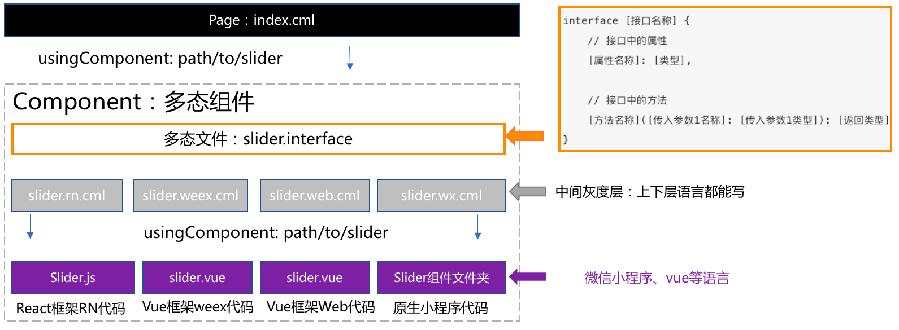

# 实现多态 ECharts 组件

## 背景介绍

正常情况下大部分功能可以用 CML 语法即可实现；常常会有特殊情况：

- 当我们想实现一个特别**复杂功能**时常常会用到成熟的第三方库
- 当产品经理需要各端差异化实现需求
- 类似“分享到朋友圈”功能在小程序、Web、Native 天生有底层能力差异

我们这里举例实现一个柱状图图表一般会想到很强大的开源可视化库[echart](http://echarts.baidu.com/)。

本文讲讲如何在 CML 项目中优雅的使用 ECharts 库,最终效果图如下：


在 CML 项目中使用第三方库可以基于多态组件来开发。


多态协议的意义我就不做赘述了，直接说怎么使用。

## 项目初始化

新建一个项目 `demo-poly`

```bash
cml init project
```

在项目中调用组件创建命令：

```bash
cd demo-poly
cml init component
```

1. 切换选择**Polymorphic component**

2. 输入`echart`


此时项目中看到`./src/components/echart`文件夹

```bash
./src/components
└── echart
    ├── echart.interface
    ├── echart.web.cml
    ├── echart.weex.cml
    └── echart.wx.cml
```

修改 src/pages/index/index.cml 文件里面的 json 配置，引用多态组件

```
  "base": {
    "usingComponents": {
      "echart": "/components/echart/echart",
      "demo-com": "/components/demo-com/demo-com"
    }
  }
```

修改 src/pages/index/index.cml 文件里面的组件`template`模板，调用`echart`组件

```vue
<template>
  <page title="chameleon">
    <view class="scroller-wrap">
      <demo-com title="{{title}}" image-src="{{chameleonSrc}}"></demo-com>
      <echart class="echart" name="hi"></echart>
    </view>
  </page>
</template>
```

修改 style 标签代码给`<echart>`标签添加宽高

```css
.scroller-wrap {
  display: flex;
  flex-direction: column;
  align-items: center;
}
.echart {
  display: flex;
  flex-direction: row;
  justify-content: center;
  height: 500cpx;
  width: 500cpx;
}
```

在项目根目录下启动预览`cml dev`，有效果如下，展现 2 个组件分别是默认项目初始化放置的`<demo-com>`和我们刚刚添加的`<echart>`组件。
echart 作为多态组件，在 web、weex、微信小程序分别展示的是不同文案。

Web 端效果如下：


## 多态组件构成介绍

**echart.interface**：描述 echart 组件的输入和输出。

默认 interface 定义了一个组件，参数**name**的值是一个字符串，事件**onshow**的值是一个函数，函数的回调是一个**Object**结构为`{value: 字符串}`。

```vue
<script cml-type="interface">
/*
定义一个inteface用于描述组件的属性和事件
1、 如何区分组件属性和事件？
通过类型来区分，事件为函数类型，属性为非函数类型
2、 如何定义组件属性
给interface添加同名的属性即可，指定类型
3、 如何定义组件事件
以事件名称为key值给interface定义属性，该属性是一个函数类型，返回值为void，
定义函数的第一个参数为自定义事件传递的detail对象类型
*/

//定义事件detail对象的参数
type EventDetail = {
  value: String,
};
interface EchartInterface {
  name: String;
  onshow(eventDetail: EventDetail): void;
}
</script>
```

这里我们先不用改。

**echart.web.cml**、**echart.weex.cml**、**echart.wx.cml**：文件是灰度区，它是唯一可以调用下层端组件的 CML 文件，分别是 web、weex、wx 三个端的调用入口。建议这一块代码尽量薄，只是用来调用下层端代码，不要编写过于重的代码。

- 在灰度区的 template 模板中：可以调用下层组件，传入的属性也可以是各自下层端的语法，绑定的函数回调事件对象也是原始对象。也可以正常使用普通的 cml 模板语法

- 在灰度区的 script 逻辑代码中：可以调用下层端的全局变量和任意方法，以及下层段的生命周期。也可以正常使用普通 cml 逻辑代码。

- 在灰度区的 style 样式代码中：可以使用下层端 css 语法。也可以正常调用 cmss 语法。

## 实现微信 ECharts

我们先修改**./src/components/echart/echart.wx.cml**实现微信的 ECharts 功能。
Google 搜索到了[echarts-for-weixin](https://github.com/ecomfe/echarts-for-weixin)，我们看该项目的使用文档，我们把该项目下的[ec-canvas](https://github.com/ecomfe/echarts-for-weixin/tree/master/ec-canvas)文件夹拷贝到`./src/components/echart`文件夹下

```bash
./src/components
└── echart
    ├── ec-canvas
    │   ├── ec-canvas.js
    │   ├── ec-canvas.json
    │   ├── ec-canvas.wxml
    │   ├── ec-canvas.wxss
    │   ├── echarts.js
    │   └── wx-canvas.js
    ├── echart.interface
    ├── echart.web.cml
    ├── echart.weex.cml
    └── echart.wx.cml
```

**不检查第三方库的全局变量**

CML 默认会检查代码中禁止使用某端特有的全局变量，`echarts.js` 作为微信小程序代码，其中有 Web 端所特有的 `window` 全局变量，编译是会报错，所以这种第三方库建议不做检查。
在项目根目录下的`chameleon.config.js` 添加。

```javascript
globalCheckWhiteList: [/node_modules/, 'echarts.js', 'wx-canvas.js'];
```

**不 babel 编译第三方库**
第三方库 `ec-echart`已经是编译后包所以为了提升编译速度，配置不做 babel 处理。

```javascript
// 引入 path 模块
var path = require('path');
excludeBablePath: [path.resolve(__dirname, './src/components/echart/ec-canvas')];
```

修改**./src/components/echart/echart.wx.cml**文件里面的 json 配置，引用微信组件

```javascript
  "base": {
    "usingComponents": {
      "ec-canvas": "./ec-canvas/ec-canvas"
    }
  }
```

修改 cml 模板，调用组件

```vue
<template>
  <view class="container">
    <ec-canvas class="mychart_dom_bar" canvas-id="mychartbar" ec="{{ ec }}"></ec-canvas>
  </view>
</template>
```

新建**./src/components/echart/bar.js**，作为统一存放 ECharts 图表的配置代码，代码如下：

```javascript
export default function getdata() {
  var option = {
    tooltip: {},

    xAxis: {
      data: ['衬衫', '羊毛衫', '雪纺衫'],
    },
    yAxis: {},
    series: [
      {
        name: '销量',
        type: 'bar',
        data: [5, 20, 36],
      },
    ],
  };
  return option;
}
```

修改**./src/components/echart/echart.wx.cml**文件里面的 JS 代码，编写传递给组件的参数

```javascript
import * as echarts from './ec-canvas/echarts';

let chart = null;
import getBar from './bar';
function initChart(canvas, width, height) {
  chart = echarts.init(canvas, null, {
    width: width,
    height: height,
  });
  canvas.setChart(chart);
  chart.setOption(getBar());
  return chart;
}

class Echart implements EchartInterface {
  props = {
    name: {
      type: String,
      default: '默认值',
    },
  };

  data = {
    ec: {
      onInit: initChart,
    },
  };

  computed = {};

  watch = {};

  methods = {};

  beforeCreate() {}

  created() {}

  beforeMount() {}

  mounted() {
    this.$cmlEmit('onshow', {
      value: this.name,
    });
  }

  beforeDestroy() {}

  destroyed() {}
}

export default new Echart();
```

修改**./src/components/echart/echart.wx.cml**文件里面的 style 代码，设置宽高

```css
.mychart_dom_bar,
.container {
  height: 750cpx;
  width: 750cpx;
}
```

此时能看到微信能展现图表了


## 实现 Web 端 ECharts

Web 端使用 vue 框架，所以找到 ECharts 的 Vue 版本[vue-echarts](https://github.com/ecomfe/vue-echarts)，
按他说明文档，直接在 CML 项目根目录 `demo-poly` (我创建的 project 名) 下安装组件

```
npm install echarts vue-echarts --save

```

打开**src/components/echart/echart.web.cml**
修改 json 标签配置，引用组件

```javascript
{
  "base": {
    "usingComponents": {
      "chart": "vue-echarts/components/ECharts"
    }
  }
}
```

修改 cml 模板，调用组件

```vue
<template>
  <view class="container">
    <chart
      class="mychart_dom_bar"
      :options="bar"
      :init-options="initOptions"
      ref="bar"
      theme="ovilia-green"
      auto-resize
    />
  </view>
</template>
```

修改 script，设置传入 chart 组件的参数

```javascript
import 'echarts/lib/chart/bar';
import getBar from './bar';
class Echart implements EchartInterface {
  props = {
    name: {
      type: String,
      default: '默认值',
    },
  };

  data = {
    bar: getBar(),
    initOptions: {
      renderer: 'canvas',
    },
  };

  computed = {};

  watch = {};

  methods = {};

  beforeCreate() {}

  created() {}

  beforeMount() {}

  mounted() {
    this.$cmlEmit('onshow', {
      value: this.name,
    });
  }

  beforeDestroy() {}

  destroyed() {}
}

export default new Echart();
```

此时 Web 端也能看到图表效果了


## 实现 Native Weex 端 ECharts

weex 不支持 canvas 接口，所以无法在 wWeex 环境下运行，我们可以用 Weex 的[eb 组件](https://weex.apache.org/zh/docs/components/web.html)

需要注意点就是 Weex 的[web](https://weex.apache.org/zh/docs/components/web.html)组件是用于展示一个页面的

所以，我们需要新建一个页面用于展示 ECharts

```vue
cml init page 然后输入页面名称 weex-echarts
```

然后在 `./src/pages/weex-echarts/weex-echarts.cml`中写入图表这个页面的内容

```vue
<template>
  <page title="chameleon">
    <scroller height="{{-1}}">
      <view class="scroller-wrap">
        <echart class="echart" name="hi"></echart>
      </view>
    </scroller>
  </page>
</template>

<script>
class Index {
  data = {};
}

export default new Index();
</script>
<style>
.scroller-wrap {
  display: flex;
  flex-direction: column;
  align-items: center;
}
.echart {
  display: flex;
  flex-direction: row;
  justify-content: center;
  height: 500cpx;
  width: 500cpx;
}
</style>
<script cml-type="json">
{
  "base": {
    "usingComponents": {
      "echart": "/components/echart/echart",
    }
  },
  "wx": {
    "navigationBarTitleText": "index",
    "backgroundTextStyle": "dark",
    "backgroundColor": "#E2E2E2"
  }
}
</script>
```

在`./src/components/echart/echart.weex.cml`里面修改

```vue
<template>
  <web
    :src="h5url"
    @pagestart="onPageStart"
    @pagefinish="onPageFinish"
    @error="onError"
    @receivedtitle="onReceivedTitle"
  ></web>
</template>

<script>
class Echart implements EchartInterface {
  props = {
    name: {
      type: String,
      default: '默认值',
    },
  };
  data = {
    pagestart: '',
    pagefinish: '',
    title: '',
    error: '',
    canGoBack: false,
    canGoForward: false,
    //这是作者的本机IP,cml/h5/weex-echarts 这个页面只有echarts图表
    h5url: 'http://172.22.137.224:8000/cml/h5/weex-echarts',
  };
  methods = {
    onPageStart: function(e) {
      this.pagestart = e.url;
    },
    onPageFinish: function(e) {
      this.pagefinish = e.url;
      this.canGoBack = e.canGoBack;
      this.canGoForward = e.canGoForward;
      if (e.title) {
        this.title = e.title;
      }
    },
    onError: function(e) {
      this.error = url;
    },
    onReceivedTitle: function(e) {
      this.title = e.title;
    },
  };
  mounted() {
    this.$cmlEmit('onshow', {
      value: this.name,
    });
  }
}

export default new Echart();
</script>

<style>
.mychart_dom_bar {
  height: 500cpx;
  width: 750cpx;
}
.container {
  height: 500cpx;
  width: 750cpx;
}
</style>

<script cml-type="json">
{
  "base": {
    "usingComponents": {
    }
  }
}
</script>
```

此时 Weex 端也能看到图表效果了


## 资源

- 本文中例子源码： https://github.com/GongLLei/cml-echarts-demo
- 预览地址： http://gonglei.me/cml-echarts-demo/dist/web/cml-echarts-demo.html#/index

## 最后

- 同时如果有更多配置参数需要由调用方 index.cml 传入时，可以再 echart.interface 中定义更多输入输出的参数，保障各端一致。

- 基于多态协议开发各端上实现差异较大的一类组件，调用上抹平了差异，同时我们可以各自维护，修改其中一端代码时，不会影响其他端的代码，做到充分隔离。

- 后期我们可以把这 **src/components/echart** 单独发布成一个 npm 包，单拉出来维护
