# 普通项目使用 CML 跨端组件

## 背景介绍

这里考虑如下场景，很多基础组件是多端共用的，单独开发则需要维护多套代码，而使用 chameleon 维护一套跨端 ui 库，通过组件导出给某一端进行使用，这样提高的开发效率可想而知。本文将一步一步介绍如何导出某一端组件及应用。

## 项目初始化

关于 chameleon-cli 的安装及环境配置请参照[快速上手](/quick_start/quick_start.md)，首先使用项目初始化命令`cml init project`完成项目初始化，然后`cd projectName`进入项目目录使用`cml init component`初始化 diaolog 组件，这里选择普通组件。最终 dialog 组件效果如下图：

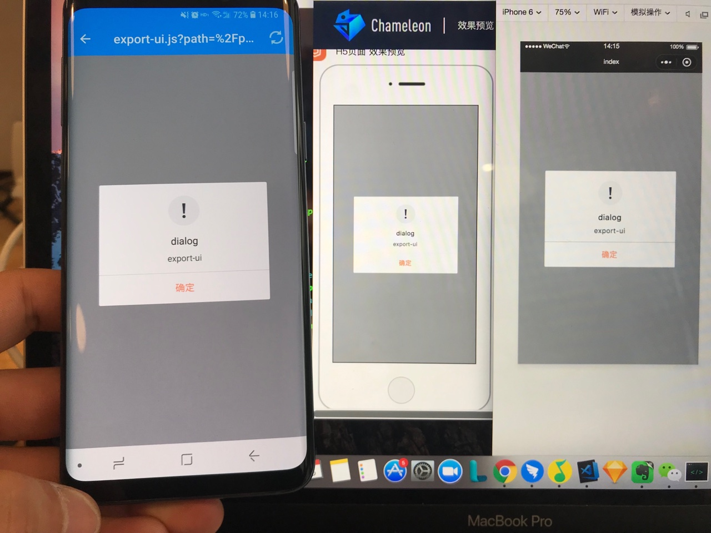

## web 端组件导出及应用

### 导出

首先是配置 chameleon.config.js，增加如下配置:

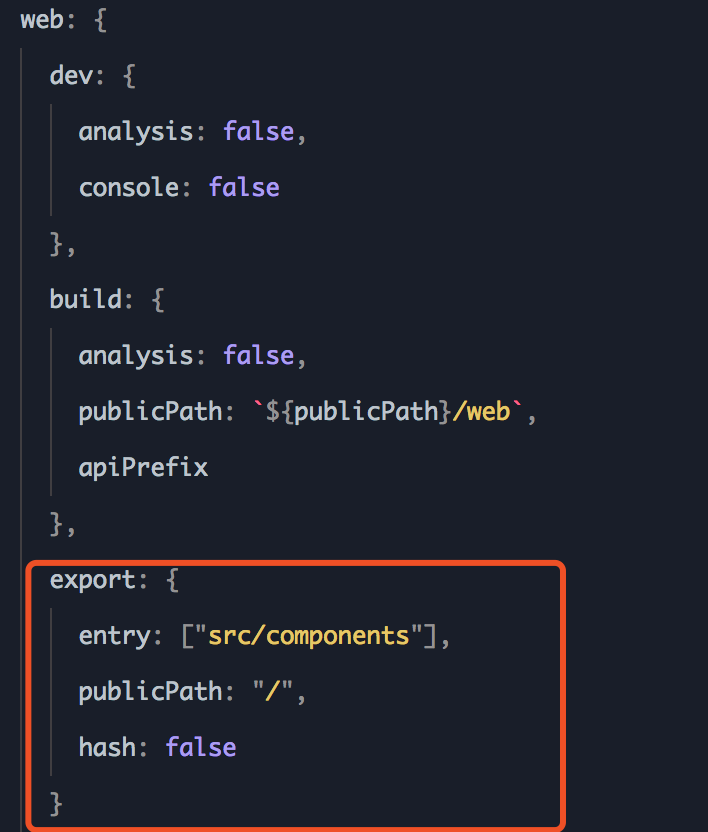

更多配置请参照[组件导出应用](/framework/compont_export.md)
完成配置后进入项目目录，使用`cml web export`命令执行 web 端组件导出，导出目录如下：

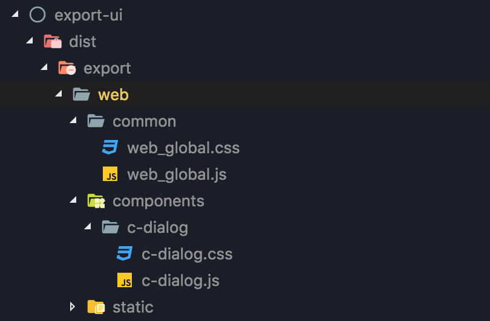

### 应用

 组件导出后我们直接用 vue-cli 创建一个 webpack 项目，这里使用的是 vue-cli@2.9.6。 初始化  项目如下图：

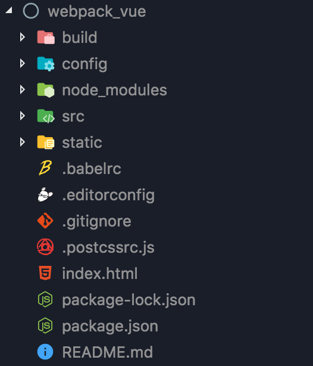
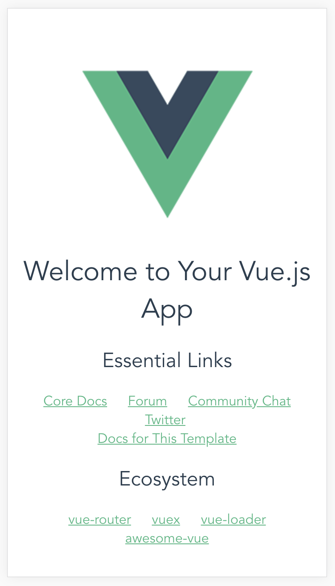

现在开始  增加导出组件的配置。

第一步：修改 .babelrc 文件，删除 `modules: false`，前后对比如下图：

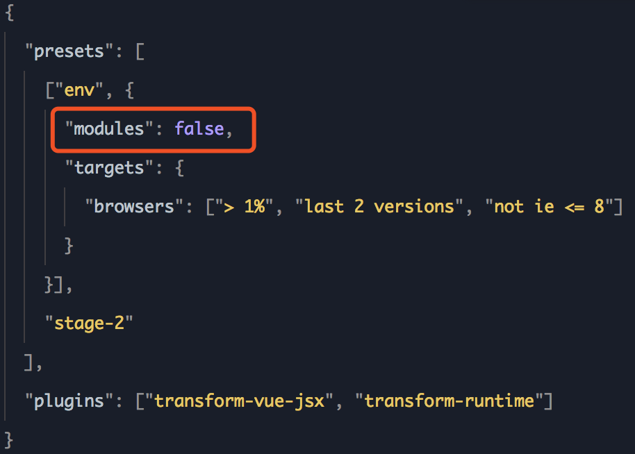
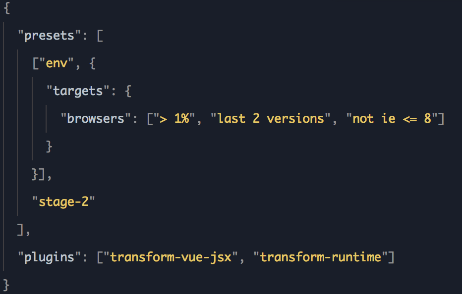

第二步：将 common 文件夹拷贝至 webpack 项目资源  目录，并  在 webpack 项目的入口文件中引入 web_global.js，代码如下图：
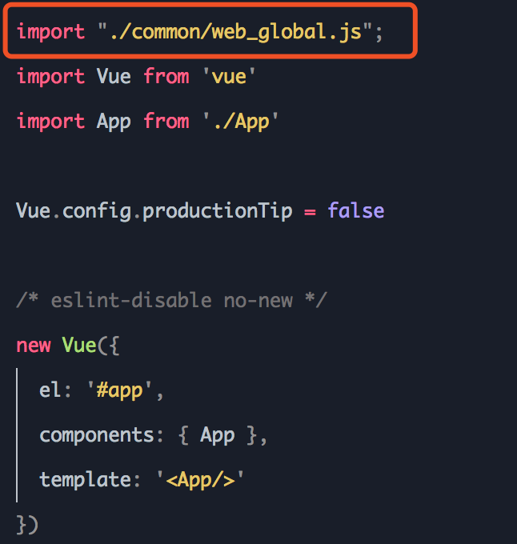

 现在将前面导出的 dialog 组件拷贝至 webpack 项目的组件目录  下，拷贝后 webpack 项目目录结构如下图：
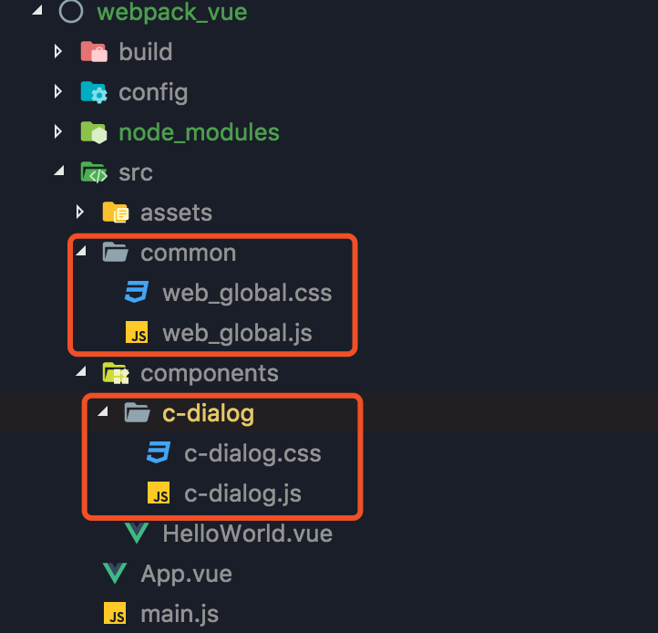

然后 app.vue 文件中直接使用 c-dialog 组件，代码如下：

```vue
<template>
  <div id="app">
    
    <CDialog :show="true" title="dialog" content="export-ui"></CDialog>
  </div>
</template>

<script>
import CDialog from './components/c-dialog/c-dialog.js';

export default {
  name: 'App',
  components: {
    CDialog,
  },
};
</script>

<style>
@import './components/c-dialog/c-dialog.css';
</style>
```

最终  效果如下图：
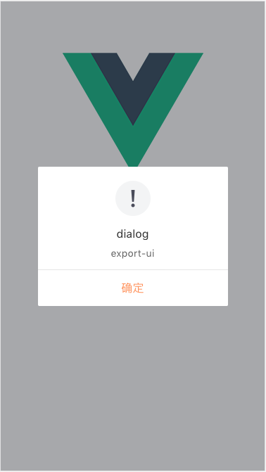

## weex 端组件导出及应用

### 导出

首先是配置 chameleon.config.js，为 weex 端增加如下配置：

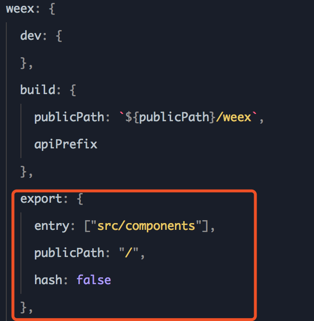

更多配置信息请查看[组件导出应用](/framework/compont_export.md)，配置好之后在该项目目录下执行`cml weex export`命令执行 weex 端组件导出，导出目录如下：
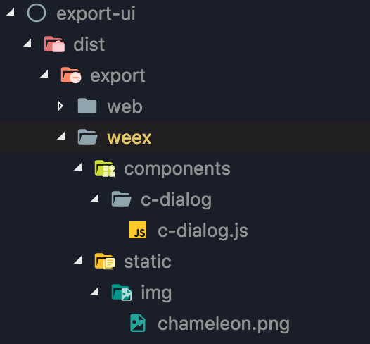

### 应用

首先通过[weex 官网](http://weex-project.io/cn/guide/set-up-env.md)提供的`weex-toolkit`初始化 weex 项目，初始化项目如下图：
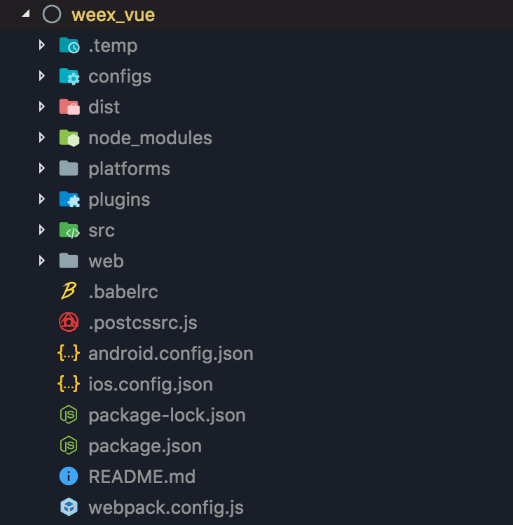
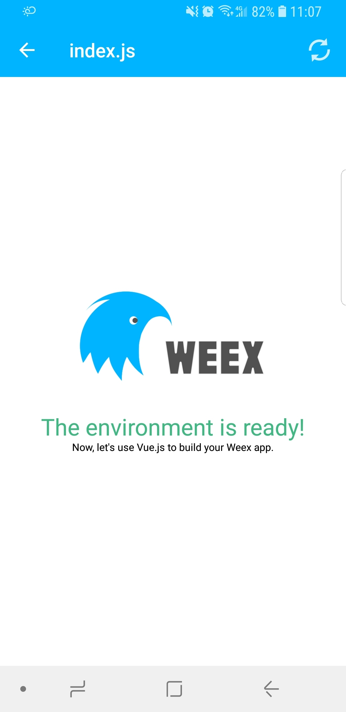

将前面导出的 dialog 组件拷贝值 weex 项目的组件目录下，拷贝后目录结构如下图：
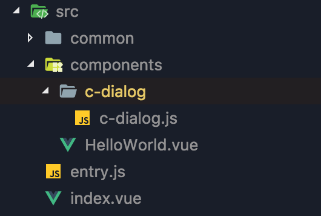

然后在 index.vue 组件中引入并使用 c-dialog 组件，代码如下：

```vue
<template>
  <div class="wrapper">
    <image :src="logo" class="logo" />
    <text class="greeting">The environment is ready!</text>
    <HelloWorld />
    <CDialog :show="true" title="dialog" content="export-ui"></CDialog>
  </div>
</template>

<script>
import HelloWorld from '@/components/HelloWorld';
import CDialog from '@/components/c-dialog/c-dialog.js';
export default {
  name: 'App',
  components: {
    HelloWorld,
    CDialog,
  },
  data() {
    return {
      logo: 'https://gw.alicdn.com/tfs/TB1yopEdgoQMeJjy1XaXXcSsFXa-640-302.png',
    };
  },
};
</script>

<style scoped>
.wrapper {
  justify-content: center;
  align-items: center;
}
.logo {
  width: 424px;
  height: 200px;
}
.greeting {
  text-align: center;
  margin-top: 70px;
  font-size: 50px;
  color: #41b883;
}
.message {
  margin: 30px;
  font-size: 32px;
  color: #727272;
}
</style>
```

最终效果如下图：
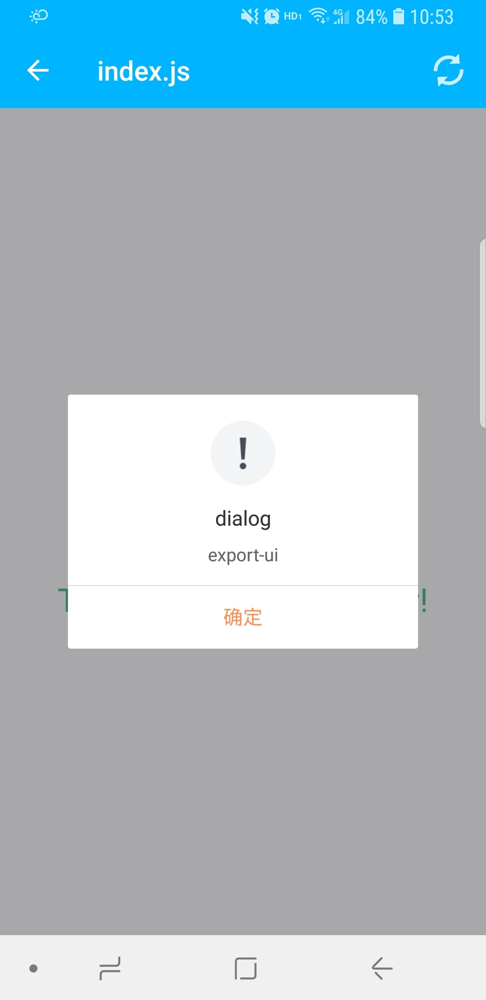

## 小程序端（wx、alipay、baidu）组件导出及应用

### 导出

首先在 chameleon.config.js 增加小程序端导出配置，这里以微信小程序举例：

```js
{
  wx: {
    export: {
      entry: ['src/components/c-dialog'],
      publicPath: 'https://static/resource.com' //静态资源线上地址,
      hash: false      //方便使用，导出组件名不加hash
    }
  }
}
```

更多配置信息请查看[组件导出应用](/framework/compont_export.md)，配置好之后在该项目目录下执行`cml wx export`命令执行 wx 端组件导出，导出目录如下：
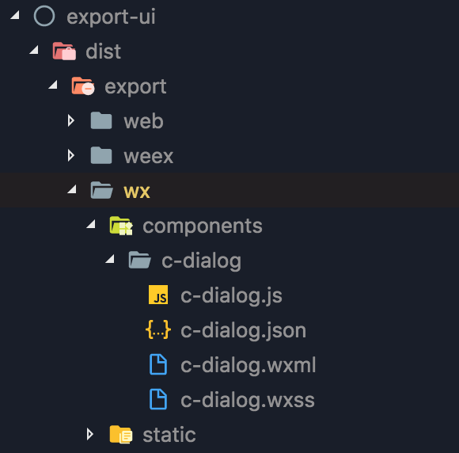

> 支付宝小程序组件导出命令为：`cml alipay export`, 百度小程序组件导出命令为：`cml baidu export`

### 应用

首先通过微信小程序开发者工具初始化项目，如下图：
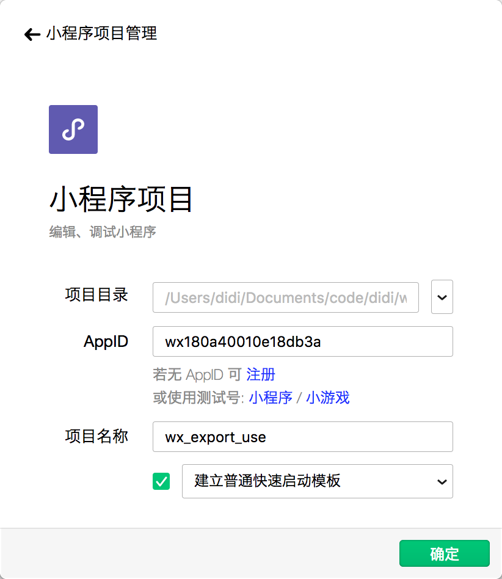

将导出的组件文件目录拷贝至微信小程序项目根目录下，拷贝后目录结构如下图：
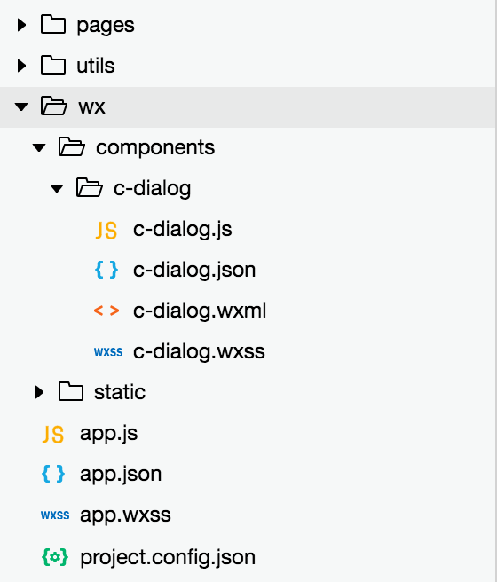

这里我们直接在微信默认创建的首页中使用，代码如下：

```vue
// index.json { "usingComponents": { "c-dialog": "/wx/components/c-dialog/c-dialog" } }
```

```vue
// index.wxml
<!--index.wxml-->
<view class="container">
  <view class="userinfo">
    <button
      wx:if="{{!hasUserInfo && canIUse}}"
      open-type="getUserInfo"
      bindgetuserinfo="getUserInfo"
    >
      获取头像昵称
    </button>
    <block wx:else>
      <image
        bindtap="bindViewTap"
        class="userinfo-avatar"
        src="{{userInfo.avatarUrl}}"
        mode="cover"
      ></image>
      <text class="userinfo-nickname">{{userInfo.nickName}}</text>
    </block>
  </view>
  <view class="usermotto">
    <text class="user-motto">{{motto}}</text>
  </view>
  <c-dialog show="{{true}}" title="dialog" content="export-ui"></c-dialog>
</view>
```

最终效果如下图：
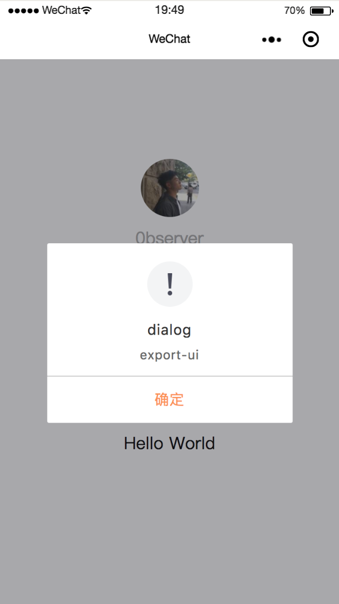

## 注意

在使用组件导出时，组件所用静态资源必须为线上资源。
