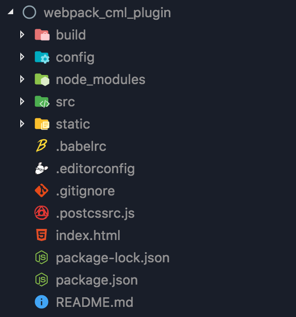
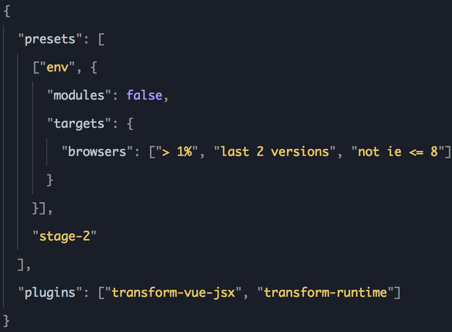
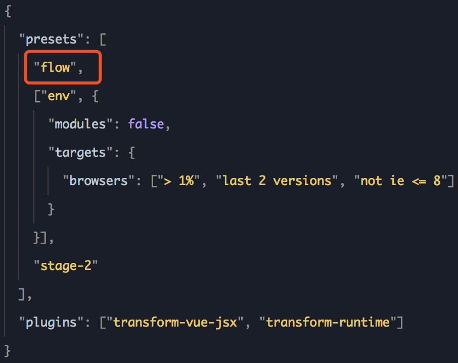
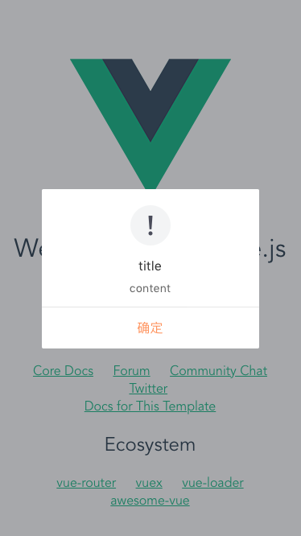

# webpack 集成 CML

<b>注：内部 webpack 插件版本基于 webpack@3.12.0 开发选择，暂不兼容 webpack4。</b>

## 背景介绍

在 webpack 项目中使用 chamelon 组件有两种方式，一种是将[组件导出](export-cml-component.md)到项目中进行使用，而另一种是直接在 webpack 项目中集成 CML 为其增加 CML 的编译能力，集成后可直接使用 chamelon 的语法进行开发。本文将一步一步介绍如何集成 CML 及使用已有 CML 组件和开发 CML 组件。

## 项目初始化

首先需要初始化一个 webpack 项目，这里直接使用 vue-cli，初始化项目如下图：



## 集成 CML

#### 第一步：在 webpack 项目下执行`npm i easy-chameleon chameleon-ui-builtin`命&令，安装集成依赖。

#### 第二步：执行`node node_modules/\easy-chameleon/bin/index.js`命令，安装 CML 依赖。

#### 第三步：修改.babelrc 文件，为 preset 添加 flow，在 CML 中使用了 flow 语法，下图是修改前后对比：




#### 第四步：在入口文件中引入`easy-chameleon/entry/web_global.js`文件，代码如下：

```js
import 'easy-chameleon/entry/web_global.js';
import Vue from 'vue';
import App from './App';

Vue.config.productionTip = false;

new Vue({
  el: '#app',
  components: { App },
  template: '<App/>',
});
```

#### 第五步：修改 webpack 配置文件，增加 CML 编译能力。

修改 webpack.base.conf.js 文件，代码如下：

```js
const { getConfig } = require('easy-chameleon');
const merge = require('webpack-merge');

module.exports = merge(
  baseConfig,
  getConfig({
    cmlType: 'web',
    media: 'dev',
    hot: true,
    disableExtract: false,
    context: path.join(__dirname, '../'),
    cmss: {
      rem: false,
      scale: 0.5,
    },
  }),
);
```

这里只贴出了该文件中所增加的代码，其中 baseConfig 为 webpack 原有配置。至此，webpack 项目已成功集成 CML

## 使用已有 CML 组件

我们已经使用 CML 开发出一套 UI 组件库，这里我们直接在 webpack 中使用。

首先，执行`npm install cml-ui` 命令安装 `cml-ui` 组件库，安装成功后我们直接在 app.vue 中使用，代码如下：

```vue
<template>
  <div id="app">
    
    <HelloWorld />
    <CDialog :mask="true" :show="true" title="title" content="content"></CDialog>
  </div>
</template>

<script>
import HelloWorld from './components/HelloWorld';
import CDialog from 'cml-ui/components/c-dialog/c-dialog';

export default {
  name: 'App',
  components: {
    HelloWorld,
    CDialog,
  },
};
</script>

<style>
#app {
  font-family: 'Avenir', Helvetica, Arial, sans-serif;
  -webkit-font-smoothing: antialiased;
  -moz-osx-font-smoothing: grayscale;
  text-align: center;
  color: #2c3e50;
  margin-top: 60px;
}
</style>
```

最终效果如下图：



## 开发 CML 组件

在组件目录下新建`.cml`文件，CML 组件模版如下：

```vue
<template> </template>

<script>
class CML {
  data = {};

  computed = {};

  watch = {};

  methods = {};

  beforeCreate() {}

  created() {}

  beforeMount() {}

  mounted() {}

  beforeDestroy() {}

  destroyed() {}
}

export default new Chameleon();
</script>

<style scoped></style>

<script cml-type="json">
{
  "base": {
    "usingComponents": {
    }
  }
}
</script>
```

我在项目中新建了一个`HelloChamelon.cml`组件，开发完成后在`App.vue`中引入使用，代码如下:

```vue
<template>
  <div id="app">
    
    <hello-cml />
  </div>
</template>

<script>
import HelloCML from './components/HelloCML';

export default {
  name: 'App',
  components: {
    HelloCML,
  },
};
</script>

<style>
#app {
  font-family: 'Avenir', Helvetica, Arial, sans-serif;
  -webkit-font-smoothing: antialiased;
  -moz-osx-font-smoothing: grayscale;
  text-align: center;
  color: #2c3e50;
  margin-top: 60px;
}
</style>
```

最终效果如下图：


##  注意

在 CML 组件开发中  样式单位为 `cpx`，编译时默认会转为 `rem`， 具体单位转换规则参考项目配置中的 CMSS 处理。
