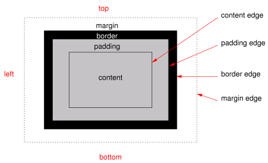

# 盒模型



chameleon 盒模型基于 CSS 盒模型，每个 chameleon 元素都可视作一个盒子。我们一般在讨论设计或布局时，会提到「盒模型」这个概念。

盒模型描述了一个元素所占用的空间。每一个盒子有四条边界：外边距边界 margin edge, 边框边界 border edge, 内边距边界 padding edge 与内容边界 content edge。这四层边界，形成一层层的盒子包裹起来，这就是盒模型大体上的含义。

- `width {length}`：，默认值 0
- `height {length}`：，默认值 0
- `padding {length}`：内边距，内容和边框之间的距离。默认值 0

可有以下写法:

```markdown
- `padding-left {length}`：，默认值 0
- `padding-right {length}`：，默认值 0
- `padding-top {length}`：，默认值 0
- `padding-bottom {length}`：，默认值 0
```

支持简写模式：`padding：{length length length length}`

- margin：

外边距，元素和元素之间的空白距离。值类型为 length，默认值 0

可有如下写法：

```
- `margin-left {length}`：，默认值 0
- `margin-right {length}`：，默认值 0
- `margin-top {length}`：，默认值 0
- `margin-bottom {length}`：，默认值 0
```

支持简写模式：`margin:{length length length length}`

- border：
  设定边框，简写方式：`border：1px solid #ff0000;`

可有如下写法：

```markdown
- border-style：

设定边框样式，值类型为 string，可选值为 `solid | dashed | dotted`，默认值 solid

可有如下写法：

    - `border-left-style {string}`：可选值为 `solid | dashed | dotted`，默认值 solid
    - `border-top-style {string}`：可选值为 `solid | dashed | dotted`，默认值 solid
    - `border-right-style {string}`：可选值为 `solid | dashed | dotted`，默认值 solid
    - `border-bottom-style {string}`：可选值为 `solid | dashed | dotted`，默认值 solid

- border-width {length}：

设定边框宽度，非负值, 默认值 0

可有如下写法：

    - `border-left-width {length}`：，非负值, 默认值 0
    - `border-top-width {length}`：，非负值, 默认值 0
    - `border-right-width {length}`：，非负值, 默认值 0
    - `border-bottom-width {length}`：，非负值, 默认值 0

- border-color {color}：

设定边框颜色，默认值 `#000000`

可有如下写法：

    - `border-left-color {color}`：，默认值 #000000
    - `border-top-color {color}`：，默认值 #000000
    - `border-right-color {color}`：，默认值 #000000
    - `border-bottom-color {color}`：，默认值 #000000

- border-radius {length}：

设定圆角，默认值 0

可有如下写法：

    - `border-bottom-left-radius {length}`：，非负值, 默认值 0
    - `border-bottom-right-radius {length}`：，非负值, 默认值 0
    - `border-top-left-radius {length}`：，非负值, 默认值 0
    - `border-top-right-radius {length}`：，非负值, 默认值 0
```

** 注意 **

chameleon 盒模型的 box-sizing 默认为 border-box，即盒子的宽高包含内容、内边距和边框的宽度，不包含外边距的宽度。

目前在 <image> 组件上尚无法只定义一个或几个角的 border-radius。比如你无法在这两个组件上使用 `border-top-left-radius`。该约束只对 iOS 生效，Android 并不受此限制。

尽管 overflow:hidden 在 Android 上是默认行为，但只有下列条件都满足时，一个父 view 才会去 clip 它的子 view。这个限制只对 Android 生效，iOS 不受影响。

- 父 view 是 div, a, cell, refresh 或 loading。
- 系统版本是 Android 4.3 或更高。
- 系统版本不是 Andorid 7.0。
- 父 view 没有 background-image 属性或系统版本是 Android 5.0 或更高。

### 示例：

```html
<template>
  <view>
    <image
      style="width: 400cpx; height: 200cpx; margin-left: 20cpx;"
      src="https://g.alicdn.com/mtb/lab-zikuan/0.0.18/weex/weex_logo_blue@3x.png"
    ></image>
  </view>
</template>
```
